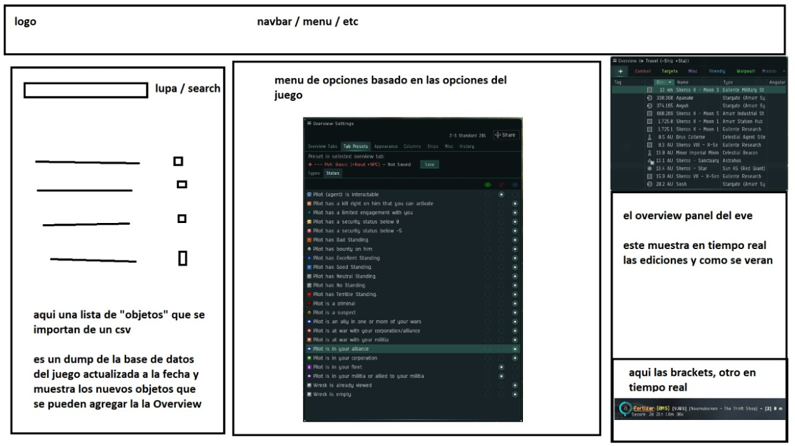

# Z-S Overview Customizer

This app is designed to be an out-of-game friendly and easy to use solution for the creation and editing of overview files (`.yaml`), which are normally located in `C:\Users\YourName\Documents\EVE\Overview` in Windows.

Made with Vue and Bootstrap.  
I know I could have made it using pure javascript, but I've been wanting to learn Vue for a while now. It also allows me to easily scale it up in the future if needed.  
And I like Bootstrap :P

## App summary


*App mockup, will update with a proper base design soon.*

The app is divided into four sections:

- Navbar (top)
- Object List (left section)
- Settings (mid section)
- Live Preview (right section)

### Navbar

The navbar is pretty simple, mainly decorative for now, but it's reserved for page linking to other tools within and outside the app.  
It also has the `Import` and `Export` buttons for the overview files.

### Object List

The Object List shows a stylized list of the latest database dump, filtered to only show objects which are visible in the in-game overview.  
The list shows objects already grouped by their group ID's (these ID's are the ones used to enable and disable objects in the in-game overview, and not the individual object ID's), but you'll able to search for individual objects by name and see their associated group ID and sibling objects.

### Settings

The Settings has all the in-game options to configure your overview.  
Plus it has enhanced editing features for naming and colouring Tabs and Presets.

### Live Preview

The Live Preview shows your changes in real time for both the overview panel and the HUD brackets.

## Stable version

You can use the latest stable version here: [Z-S Overview Customizer](https://arziel1992.github.io/Z-S-Overview-Customizer/)

Alternitavely you can clone the repository on your own machine and run it locally.

## Project setup for local run and development

These are the base commands you can use locally.  
Make sure to have [Node.js](https://nodejs.org/en/) (LTS recommended) and NPM (comes with Node) installed and updated.

### Installs dependencies from `package.json`

```bash
npm install
```

### Compiles and hot-reloads for development

```bash
npm run serve
```

### Lints and fixes files

```bash
npm run lint
```

### Compiles and minifies for production

Access the `dist` folder and open the `index.html` to run the app locally.

```bash
npm run build
```
