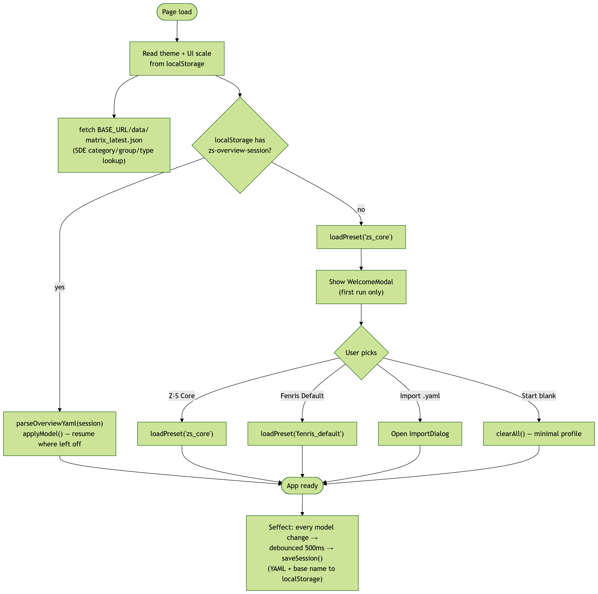
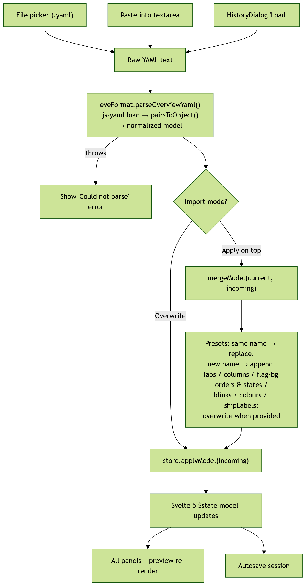
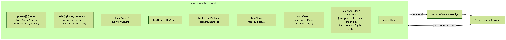
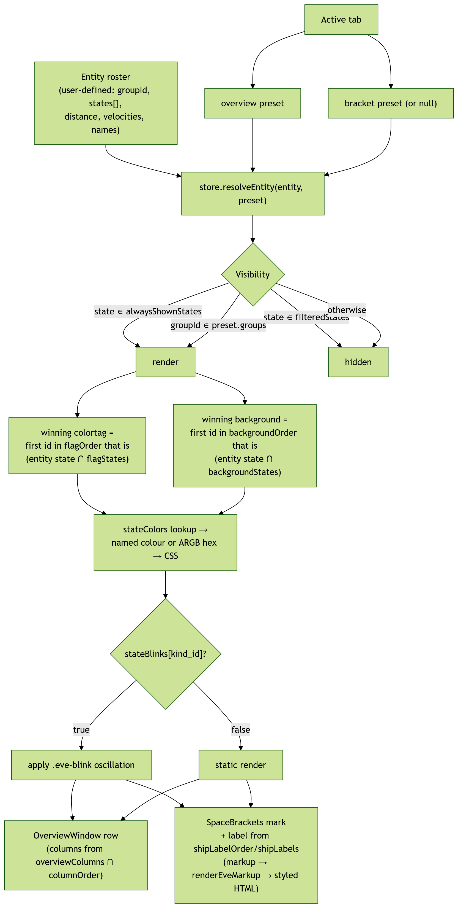
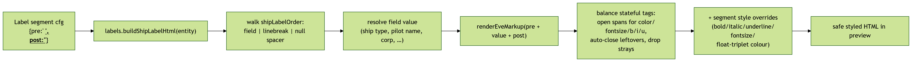
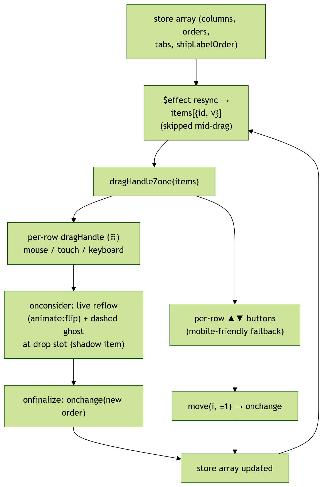
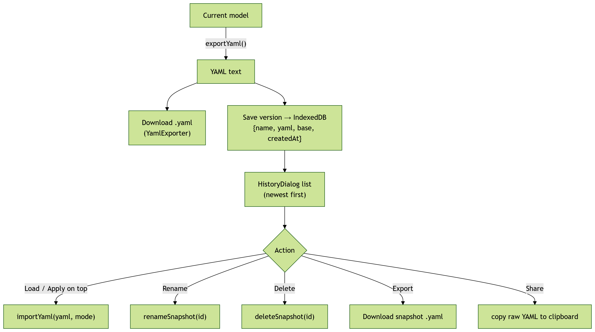
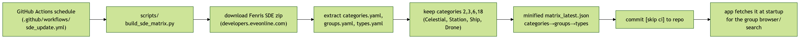

# Z-S Overview Customiser

A web-based editor for **EVE Online Overview profiles**: load a base profile, customise every
parameter the game exposes, watch a live in-game-style preview react, and export a genuine
`.yaml` you can import straight back into the client.

**Quick links:**
[Z-S Overview Pack](https://github.com/Arziel1992/Z-S-Overview-Pack/) ·
[Discord](http://discord.gg/NSfFKcx) ·
[Changelog](./CHANGELOG.md) ·
[Customiser live tool](https://arziel1992.github.io/Z-S-Overview-Customizer/)

---

## Table of contents

- [A 10th-anniversary gift to the EVE community](#a-10th-anniversary-gift-to-the-eve-community)
- [Features](#features)
- [How the EVE Overview actually works](#how-the-eve-overview-actually-works)
  - [1. The data foundation: typeID → groupID → categoryID](#1-the-data-foundation-typeid--groupid--categoryid)
  - [2. Presets: the boolean logic engine](#2-presets-the-boolean-logic-engine)
  - [3. Tabs: lists and brackets, decoupled](#3-tabs-lists-and-brackets-decoupled)
  - [4. The state matrix: colortags, backgrounds, priority](#4-the-state-matrix-colortags-backgrounds-priority)
- [YAML config key legend](#yaml-config-key-legend)
  - [Root keys](#root-keys)
  - [Telemetry column values](#telemetry-column-values)
  - [Preset variables](#preset-variables)
  - [Tab setup variables](#tab-setup-variables)
  - [The state ID table](#the-state-id-table)
- [Using your YAML out of game](#using-your-yaml-out-of-game)
- [Project layout](#project-layout)
  - [Architecture & flow diagrams](#architecture--flow-diagrams)
- [Tech stack](#tech-stack)
- [Setup](#setup)
- [Using the app](#using-the-app)
- [Contributing translations](#contributing-translations)
- [Community & support](#community--support)
- [License](#license)
- [Copyright notice](#copyright-notice)

---

## A 10th-anniversary gift to the EVE community

Life has a strange way of closing loops. Early in **June 2026**, a change in my
circumstances led me back to a game I hadn't logged into for the better part of a
decade — EVE Online. Not long after I undocked, **Kismeteer**, the volunteer who
currently keeps the Z-S Overview pack alive, noticed I was around. We got to
chatting; he walked me through the state of Z-S today and, almost in passing,
reminded me just how many years had gone by since I'd last been in New Eden.

That sent me digging, and I found it: my **first ever commit to Z-S, on June 9th,
2016**. Ten years, almost to the day. Seeing that timestamp reignited something —
including the memory of a customiser tool I'd started building for the pack years
ago and never finished.

So I finished it. This project is my **Z-S 10th-anniversary gift to the EVE
community** — for everyone who's ever fought, hauled, ratted, or run for their pod
behind a Z-S overview. Fly safe. o7

---

## Features

- **Real EVE format, both ways.** Loads and exports the actual in-game overview
  YAML (ordered-map tuples, integer state ids, `<color=…>` / `<fontsize=…>`
  markup). Both bundled bases — **Fenris Default** and **Z-S Core** — parse through
  the same pipeline, and exports round-trip cleanly back into EVE.
- **1:1 settings mirror.** Tabs, Presets — create, duplicate, rename and delete
  them (renames cascade into the tabs that use them) plus their groups /
  filtered states / always-shown states — Columns, Appearance (colortag +
  background priority, colour pickers, blink), Ship Labels, Misc, and a live
  YAML view.
- **Customisable live preview.** Add your own entities to the roster and watch
  them update live in a game-accurate overview list and a tactical bracket view
  with a twinkling starfield — including fully styled `shipLabels` bracket text.
- **Import any YAML** (file or paste) with a choice of **Overwrite** or
  **Apply on top** — multi-part packs (like the Z-S pieces) merge onto a core
  profile exactly as they do in-game: same-named presets are replaced, new ones
  appended, and layout sections (tabs, columns, appearance, labels) are
  overwritten when the pack provides them.
- **Version history** saved in your browser (IndexedDB): name, reload, rename,
  delete, re-export, or **share** (copies the YAML to your clipboard — no
  third-party services).
- **Drag-and-drop reordering** (mouse and touch) with a ghost drop-slot and live
  reflow, plus up/down arrows as a mobile-friendly fallback — for columns, state
  priorities, tabs and bracket-label segments.
- **Dark / light theme**, S/M/L/XL UI scale, session restore (resume where you
  left off), first-run welcome, mobile-responsive layout.
- **Multilingual UI** (English and Español so far) with a language selector in
  the header — switching applies instantly, no reload. See
  [Contributing translations](#contributing-translations).

---

## How the EVE Overview actually works

The Overview is not a passive list — it is a real-time **boolean filtering
engine** that evaluates every entity on your spatial grid against your profile,
dozens of times per second. Understanding four building blocks explains every
key in the YAML.

### 1. The data foundation: typeID → groupID → categoryID

Every object in EVE has an atomic **`typeID`** (a *Rifter*, a specific asteroid).
Types roll up into **`groupID`s** (*Frigate* = group `25`, *Stargate* = group
`10`), which roll up into **`categoryID`s** (*Ship* = category `6`). Overview
filters operate almost exclusively at the **group** level: white-listing group
`26` shows every Cruiser variant ever added to the game. This data comes from
Fenris' **Static Data Export (SDE)**; the customiser compiles it into
`public/data/matrix_latest.json` via `scripts/build_sde_matrix.py`.

### 2. Presets: the boolean logic engine

A **preset** decides *what renders*. Each one carries three arrays, evaluated
with strict precedence:

1. **`alwaysShownStates`** — supreme override. If an entity matches any state
   here, it renders **no matter what** (e.g. always show Fleet Members).
2. **`filteredStates`** — absolute veto. If an entity matches any state here, it
   is hidden **even if its group is authorised** (e.g. hide friendlies on a
   combat tab to prevent misclicks).
3. **`groups`** — the whitelist of SDE groupIDs the preset may display.

### 3. Tabs: lists and brackets, decoupled

The overview window supports up to **8 tabs**. Each tab points at **two**
presets: `overview` (the flat list) and `bracket` (the floating icons in 3D
space) — independently. A logistics pilot can list only friendlies while still
seeing hostile brackets in space to dodge incoming fire. `bracket: null`
disables space brackets for that tab entirely (a common anti-lag trick).

### 4. The state matrix: colortags, backgrounds, priority

Relationship/legal status is communicated two ways:

- **Colortags (flags)** — small icons by the entity's icon (`flagStates`,
  `flagOrder`).
- **Backgrounds** — full-row highlights for at-a-glance threat
  (`backgroundStates`, `backgroundOrder`).

A pilot can match *many* states at once (fleet member **and** criminal). The
client walks `flagOrder` / `backgroundOrder` **top to bottom and stops at the
first match** — so priority order is everything: existential threats (War
Target, Criminal, Outlaw) belong above friendly affiliations. `stateBlinks`
makes a state flash; `stateColorsNameList` maps each state to a named colour or
`0xAARRGGBB` hex.

---

## YAML config key legend

The complete reference of every key the client parses in an overview `.yaml`.

### Root keys

| Key                               | Purpose                                                                          |
| --------------------------------- | -------------------------------------------------------------------------------- |
| `flagOrder`                       | Top-to-bottom priority for colortags when multiple states match.                 |
| `flagStates`                      | Whitelist of states allowed to render a colortag at all.                         |
| `backgroundOrder`                 | Priority list for full-row background highlights.                                |
| `backgroundStates`                | Whitelist of states allowed to render a background.                              |
| `stateBlinks`                     | Per-state boolean toggles for rhythmic flashing (`flag_13`, `background_44`, …). |
| `stateColorsNameList`             | Maps states to a named colour (`orange`, `darkBlue`, …) or `0xAARRGGBB` hex.     |
| `overviewColumns` / `columnOrder` | Which telemetry columns show, and in what left-to-right order.                   |
| `presets`                         | The named boolean filters (see Preset variables below).                          |
| `tabSetup`                        | Maps tab indexes 0–7 to presets (see Tab variables below).                       |
| `shipLabelOrder` / `shipLabels`   | Order and styling of the floating bracket label segments.                        |
| `userSettings`                    | Misc client-side settings carried with the profile.                              |

### Telemetry column values

Exact strings accepted inside `overviewColumns` (misspelling breaks rendering):
`ICON`, `NAME`, `TYPE`, `TAG`, `DISTANCE`, `CORPORATION`, `ALLIANCE`, `FACTION`,
`MILITIA`, `SIZE`, `VELOCITY`, `RADIALVELOCITY`, `TRANSVERSALVELOCITY`,
`ANGULARVELOCITY`.

### Preset variables

| Key                 | Effect                                                                                                               |
| ------------------- | -------------------------------------------------------------------------------------------------------------------- |
| `alwaysShownStates` | Force-render override — bypasses all other filters.                                                                  |
| `filteredStates`    | Absolute veto — hides matching entities immediately.                                                                 |
| `groups`            | Whitelisted SDE `groupID`s (e.g. `6` Sun, `10` Stargate, `15` Station, `25` Frigate, `26` Cruiser, `27` Battleship). |

### Tab setup variables

| Key        | Effect                                                           |
| ---------- | ---------------------------------------------------------------- |
| `name`     | Tab caption; supports markup like `<color=0xFFFFFFFF>✈</color>`. |
| `overview` | Preset used for the flat list view.                              |
| `bracket`  | Preset used for in-space icons; `null` disables brackets.        |
| `color`    | Optional `[r, g, b]` float triplet tinting the tab text.         |

### The state ID table

Prefix with `flag_` or `background_` when used in `stateBlinks` /
`stateColorsNameList` (e.g. `background_13`).

| ID      | Meaning                                                     |
| ------- | ----------------------------------------------------------- |
| 9       | Neutral standing                                            |
| 10      | Bad standing                                                |
| 11      | In your fleet                                               |
| 12      | Terrible standing (−10)                                     |
| 13      | Criminal / active Suspect-Criminal timer                    |
| 14      | In your faction militia                                     |
| 15      | Excellent standing (+10)                                    |
| 16      | Good standing (+5)                                          |
| 17      | Threat to your corporation                                  |
| 18      | In your corporation                                         |
| 19      | In your alliance                                            |
| 20      | Security threat (legal/standing combos)                     |
| 21      | Has an active bounty                                        |
| 36 / 37 | Legacy veto states (edge-case entities in `filteredStates`) |
| 44      | Outlaw / valid kill right                                   |
| 45      | Low security status                                         |
| 48 / 49 | Agent / VIP entities                                        |
| 50      | Limited engagement (duel)                                   |
| 51      | At war with your militia                                    |
| 52      | Active war target                                           |
| 53      | Secondary militia/war evaluation                            |
| 66 / 68 | Faction / faction-militia states (observed in live exports) |

---

## Using your YAML out of game

Exports from this customiser (and pack files like Z-S) are imported through the
client's overview import pipeline. Adapted from the
[Z-S pack instructions](https://github.com/Arziel1992/Z-S-Overview-Pack/):

1. **Get the file(s).** Export from this app (YAML tab → *Download .yaml*), or
   download a pack release (e.g. Z-S: *Releases* → latest → the `Z-S-….zip`
   asset) and extract it. From a pack you can copy individual **preset packs +
   a layout**, or a single pre-styled **Full pack** file.
2. **Place them in EVE's Overview folder** for your platform:

   | Platform             | Path                                                                                          |
   | -------------------- | --------------------------------------------------------------------------------------------- |
   | Windows              | `%USERPROFILE%\Documents\EVE\Overview`                                                        |
   | macOS                | `~/Documents/EVE/Overview`                                                                    |
   | Linux (Steam/Proton) | `~/.steam/steam/steamapps/compatdata/8500/pfx/drive_c/users/steamuser/Documents/EVE/Overview` |

   If the folder doesn't exist, create it — or better, **export your current
   overview from the game first** (same window, *Export Overview Settings*,
   *Check All*): that backs up your settings **and** creates the folder.
3. **In game:** open the Overview Settings (the `≡` button at the top left of
   the Overview window) → **Misc** tab.
4. Optionally click **Reset All** to start from clean defaults.
5. Click **Import Overview Settings**, select your file in the left list, click
   **Check All**, then **Import**.
6. **Importing pieces?** Repeat step 5 for each preset pack, then the layout —
   that is exactly what this app's *Apply on top* import mode replicates.
7. Some elements may not refresh immediately — **dock and undock** once to
   force the UI to reload everything.

> Tip: profiles can also be shared in game by dragging a saved profile link
> into chat — recipients load it with one click.

---

## Project layout

```text
Z-S-Overview-Customizer/
├── index.html                      # entry HTML (theme bootstrapping, fonts)
├── vite.config.js                  # Vite + base path (GitHub Pages) + aliases
├── biome.json                      # lint/format config (+ Svelte overrides)
├── scripts/
│   └── build_sde_matrix.py         # Fenris SDE zip → minified matrix_latest.json
├── .github/workflows/
│   └── sde_update.yml              # scheduled CI refresh of the SDE matrix
├── public/
│   ├── data/matrix_latest.json     # categories → groups → types lookup
│   └── defaults/
│       ├── fenris_default.yaml        # stock base (real EVE format)
│       └── zs_core.yaml            # Z-S Core base (real EVE format)
├── images/                         # flow-diagram renders used in this README
├── notes/                          # local research workspace (gitignored)
└── src/
    ├── main.js                     # Svelte 5 mount
    ├── App.svelte                  # shell: header, nav, layout, dialogs, autosave
    ├── assets/tailwind.css         # theme tokens (CSS vars), starfield, blink
    └── lib/
        ├── i18n/strings.js         # all UI copy (locale-ready, t('a.b.c'))
        ├── data/stateMatrix.js     # state-ID taxonomy, colours, column defs
        ├── stores/
        │   └── customiserStore.svelte.js  # reactive profile model + roster + session
        ├── utils/
        │   ├── eveFormat.js        # YAML codec: parse/serialize, markup, colours
        │   ├── merge.js            # "apply on top" pack-merge semantics
        │   ├── history.js          # IndexedDB snapshots (clipboard sharing)
        │   └── labels.js           # shipLabels → styled bracket-label HTML
        └── components/
            ├── TabManager.svelte        # tab setup (names, presets, colours)
            ├── PresetEditor.svelte      # filter logic per preset
            ├── MatrixSelector.svelte    # SDE group browser/search
            ├── ColumnConfig.svelte      # telemetry columns
            ├── AppearanceConfig.svelte  # colortag/background priorities
            ├── ShipLabels.svelte        # bracket-label composer
            ├── MiscConfig.svelte        # profile stats + userSettings
            ├── YamlExporter.svelte      # live YAML + download/copy
            ├── OverviewWindow.svelte    # game-accurate list preview
            ├── SpaceBrackets.svelte     # starfield bracket preview
            ├── EntityRoster.svelte      # preview entities (modal editor)
            ├── ImportDialog.svelte      # file/paste import, overwrite/merge
            ├── HistoryDialog.svelte     # saved versions, share
            ├── WelcomeModal.svelte      # first-run chooser
            ├── DragList.svelte          # reusable DnD + arrows reorder list
            └── Modal.svelte             # shared dialog chrome
```

### Architecture & flow diagrams

#### 1. Startup & session lifecycle

Theme and scale come from `localStorage`; a saved session resumes exactly where
you left off, otherwise the first-run welcome offers a starting point. Every
model change autosaves (debounced) back to the session.



#### 2. YAML import pipeline

File, paste, or a history snapshot all flow through the same codec; *Apply on
top* runs the pack-merge rules (same-named presets replaced, new ones appended,
layout sections overwritten when provided), *Overwrite* replaces the model.



#### 3. The normalized profile model

The store holds the profile as plain reactive state keyed by the client's
integer state IDs; serialisation back to game-importable YAML is lossless.



#### 4. Live preview render pipeline

Each roster entity is resolved against the active tab's presets — always-shown
overrides veto, veto overrides group membership — then the first matching state
in the priority orders picks the colortag and background.



#### 5. Appearance & label styling

Bracket-label segments carry stateful EVE markup (`<fontsize=…>`, `<color=…>`,
`<b>`…) that can open in one segment and close in another; the renderer
balances it into safe styled HTML.



#### 6. Reordering UX

One reusable DragList drives columns, priorities, tabs and label segments:
drag by the handle (ghost drop-slot + live reflow) or use the arrow buttons.



#### 7. History, export & sharing

Named snapshots live in IndexedDB; sharing copies the YAML straight to your
clipboard.



#### 8. SDE data pipeline

A scheduled GitHub Action rebuilds the ship/group/category lookup from the
official Static Data Export.



---

## Tech stack

For full disclosure, the libraries and tooling this project depends on:

### Runtime dependencies

- [Svelte 5](https://svelte.dev/) (`^5`) — UI framework (runes-based reactivity).
- [js-yaml](https://github.com/nodeca/js-yaml) (`^4.2`) — YAML parse/dump powering
  the EVE overview codec.
- [svelte-dnd-action](https://github.com/isaacHagoel/svelte-dnd-action) (`^0.9`)
  — accessible, touch-friendly drag-and-drop reordering.

### Build / dev tooling

- [Vite](https://vitejs.dev/) (`^8`) + [@sveltejs/vite-plugin-svelte](https://github.com/sveltejs/vite-plugin-svelte) — dev server and bundler.
- [Tailwind CSS](https://tailwindcss.com/) (`^4`) via
  [@tailwindcss/vite](https://tailwindcss.com/docs/installation/using-vite) —
  styling with CSS-first `@theme` config, themed via CSS custom properties.
- [Biome](https://biomejs.dev/) (`2.4`) — linter / formatter.

### Browser platform APIs

- **IndexedDB** — local, named version history (no backend).
- **Clipboard API** — copy / share YAML.
- **localStorage** — theme, UI scale, and session restore.

### Data pipeline (`npm run sde:build`)

- **Python 3** with [PyYAML](https://pyyaml.org/) and
  [Requests](https://requests.readthedocs.io/) — downloads Fenris' official Static
  Data Export and compiles `matrix_latest.json`.

### External services

- Fenris' [Static Data Export](https://developers.eveonline.com/) — ship / group /
  category data (fetched at build time only, never from the browser).

> No analytics, accounts, backend, or third-party APIs — everything runs
> client-side in your browser.

---

## Setup

```bash
npm install
```

### Build the SDE lookup (optional refresh)

```bash
npm run sde:build
```

Downloads Fenris' official SDE zip, extracts `categories.yaml`, `groups.yaml`,
`types.yaml`, and writes the minified map to `public/data/matrix_latest.json`.
Requires Python with `pyyaml` and `requests`.

### Develop

```bash
npm run dev      # Vite dev server (http://localhost:3000/Z-S-Overview-Customizer/)
npm run build    # production build to dist/
npm run preview  # preview the production build
```

---

## Using the app

1. On first visit, the **welcome screen** asks what to start from: Z-S Core,
   Fenris Default, an imported `.yaml`, or a blank profile. Your work autosaves to
   the browser, so later visits **resume where you left off**.
2. Configure tabs, presets, columns, appearance, and ship labels in the left
   panel — every applicable EVE parameter is mirrored 1:1.
3. Add entities in **Preview Entities** (type/group, distance, relationship
   states) to see colortags, row backgrounds, blink, and bracket labels resolve
   live under each tab's presets.
4. **Import** more packs via *+ Custom / Import* — choose **Apply on top** to
   layer pack pieces (the in-game multi-import workflow) or **Overwrite** to
   replace everything. Save named **versions**, re-load, export, or share them.
5. Open the **YAML** tab and **Download .yaml**, then import it in game
   (see [Using your YAML out of game](#using-your-yaml-out-of-game)).

---

## Contributing translations

Each language is one file under
[src/lib/i18n/locales/](./src/lib/i18n/locales/) —
[`en.js`](./src/lib/i18n/locales/en.js) is the reference. The app falls back to
English for any key a translation hasn't covered yet, so partial translations
are safe to ship.

To add a language (say, German):

1. Copy `src/lib/i18n/locales/en.js` to `src/lib/i18n/locales/de.js`.
2. Translate the **values only** — keep every key name and `{placeholder}`
   token exactly as they are (e.g. `"{n}/8 tabs"` → `"{n}/8 Registerkarten"`).
3. Register it in `src/lib/i18n/strings.svelte.js`:

   ```js
   import de from "./locales/de.js";
   const locales = { en, es, de };
   export const LOCALE_NAMES = { en: "English", es: "Español", de: "Deutsch" };
   ```

4. Run `npm run dev`, pick the new language from the header dropdown, and click
   through every panel and dialog to sanity-check lengths and encoding.
5. Open a pull request — one new file plus two registration lines.

Guidelines: keep EVE-specific terms players know from the client (Overview,
preset, bracket, colortag) untranslated where the localized client does the
same; keep strings concise — several render inside compact controls.

---

## Community & support

- **Z-S Overview Pack:** <https://github.com/Arziel1992/Z-S-Overview-Pack/>
- **Discord:** <http://discord.gg/NSfFKcx>
- **Changelog:** [CHANGELOG.md](./CHANGELOG.md)
- Issues and PRs welcome on the
  [customiser repository](https://github.com/Arziel1992/Z-S-Overview-Customizer/).

---

## License

This project is free software, released under the
**GNU Affero General Public License v3.0** — see the [LICENSE](./LICENSE) file
for the full text. In short: you may use, study, modify and redistribute it,
provided derivative works (including network-hosted ones) remain open under the
same license.

---

## Copyright notice

EVE Online and the EVE logo are the registered trademarks of Fenris hf. All
rights are reserved worldwide. All other trademarks are the property of their
respective owners. EVE Online, the EVE logo, EVE and all associated logos and
designs are the intellectual property of Fenris hf. All artwork, screenshots,
characters, vehicles, storylines, world facts or other recognizable features of
the intellectual property relating to these trademarks are likewise the
intellectual property of Fenris hf. Fenris hf. has granted permission to
Z-S-Overview-Customizer to use EVE Online and all associated logos and designs
for promotional and information purposes on its website but does not endorse,
and is not in any way affiliated with, Z-S-Overview-Customizer. Fenris is in no
way responsible for the content on or functioning of this website, nor can it
be liable for any damage arising from the use of this website.
